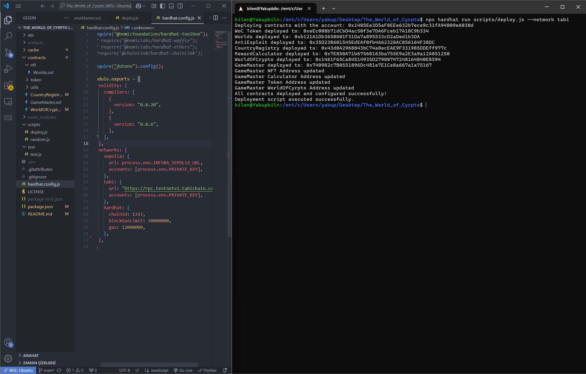

# The World of Crypto - Technical Documentation

## Overview
**The World of Crypto** is a decentralized, blockchain-based exploration game where players travel across Earth, solve culturally themed questions, and earn rewards through NFTs and tokens. Built on Ethereum/Polygon, the game integrates smart contracts for secure ownership, transactions, and rewards.

---

## Deployment Details
**Network:** Tabi Testnet

**Contract Addresses:**
- WoC Token: `0xeEc008b71dCbD4ac50f3e7DA6Fceb17A18C9b334`
- Worlds: `0xb121A1Db3658601F31Da7a895533cD2aDed1b3DA`
- AntiExploit: `0x35D23B601545EdEAf0fb4A62328AC056164F38DC`
- CountryRegistry: `0x43d0A2968843bC74a8ecEAE9F331985DDEff977c`
- RewardCalculator: `0x7E850A71b67568163ba755E9a2E3a9a12A051250`
- WorldOfCrypto: `0x1461F65Ca84514935D27980747248164840E8594`
- GameMaster: `0x740982c7B0551896Dc481e7E1Ce8a667a1a75167`

## Documentation
---
> **Note**: This project is still under development. For more details and updates, please refer to the accompanying project plan in the [Project Plan PDF](./The_World_of_Cyrpto.pdf).
---

## Game Mechanics

### 1. NFT Verification
- NFTs provide access to the game.
- Rarity levels (Common, Rare, Epic) determine potential bonus rewards.
- Players must own an NFT to participate.

### 2. Country Exploration
- Players travel across an interactive world map.
- Each country has a fixed travel fee, paid in WoC tokens.
- Travel fees vary based on country difficulty and exploration cost.

### 3. Question & Answer System
- Each country presents culturally themed questions.
- Answers are validated against an off-chain database.
- Correct answers provide rewards; incorrect answers allow continued play.

### 4. Rewards & Treasures
- Players earn rewards such as WoC tokens or rare NFTs.
- Randomized distribution ensures fairness and engagement.
- Hidden treasures provide additional incentives for exploration.

### 5. Early Exit & Refund
- Players can exit early and receive a partial refund of travel fees.
- Refunds are calculated as a percentage of the initial fee.
- This system provides flexibility for different play styles.

---

## Installation & Setup
//

## Contributing
1. Fork the repository.
2. Write tests for new features (e.g., `test/example.test.js`).
3. Submit a PR with detailed comments.

---

## License
MIT License. See LICENSE for details.

## Contact
- **Dev Team**: yakupbln00@gmail.com